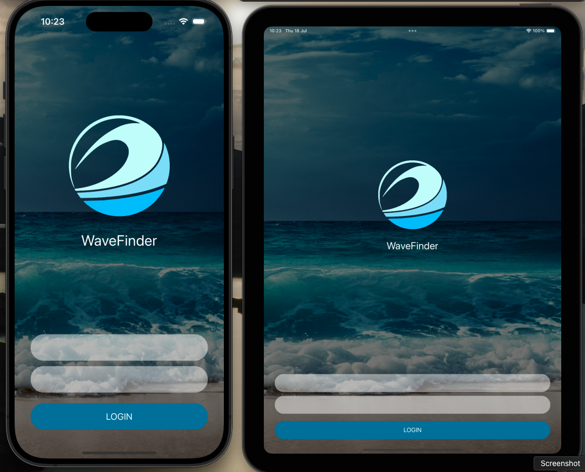

## 🎨 BeginnerAutoLayout

Este projeto está em desenvolvimento, e a tela de login será similar a esta:

  

**Observações:**

- O design é uma representação do que será implementado.
- As cores, fontes e imagens podem ser modificadas durante o desenvolvimento.

## 💻 Implementação

O código do projeto será organizado da seguinte forma:

- **ContentView.swift:** Contém a tela de login principal.
- **LoginView.swift:** Contém a estrutura da tela de login, incluindo campos de entrada, botão de login e outros elementos.
- **BackgroundView.swift:** Define a imagem de fundo da tela de login.
- **CustomTextField.swift:** Define um campo de texto personalizado para a tela de login.
- **CustomButton.swift:** Define um botão personalizado para a tela de login.

## ✨ Próximos Passos

- Implementar a tela de login utilizando SwiftUI.
- Criar elementos visuais personalizados (background, campos de texto, botões).
- Implementar a funcionalidade de login.
- Criar a próxima tela do aplicativo.

  ## 📼 Tutorial - Beginner Auto Layout & Constraints - Swift 4.2 - Xcode 10

-    <a href= "https://www.youtube.com/watch?v=m_0_XQEfrGQ"> LINK Sean Allen </a> 
## 🤝 Contribuições

Contribuições são bem-vindas! Sinta-se à vontade para abrir issues, enviar pull requests ou entrar em contato se tiver alguma dúvida.

## 👨‍💻 Student

    
    
   rluispdev 
       
    <a href="https://github.com/rluispdev">
    GitHub</a> | 
     <a href="https://cursos.alura.com.br/user/rluisp"> Alura Profile</a>
 | 
    <a href="https://www.linkedin.com/in/rafael-luis-gonzaga-b11634186/">LinkedIn</a>
 | 
    <a href="https://www.instagram.com/rluispdevs?igsh=cnoxenpmaHY1amE0&utm_source=qr">
    Instagram</a>
 | 

  

